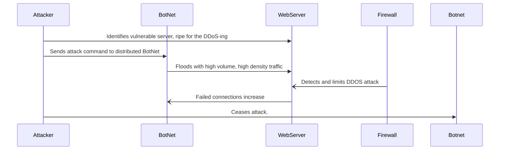

```mermaid
sequenceDiagram
participant Attacker
participant BotNet
participant WebServer
participant Firewall

Attacker->>WebServer: Identifies vulnerable server, ripe for the DDoS-ing
Attacker->>BotNet: Sends attack command to distributed BotNet
BotNet->>WebServer: Floods with high volume, high density traffic
Firewall-)WebServer: Detects and limits DDOS attack
WebServer-)BotNet: Failed connections increase
Attacker->>Botnet: Ceases attack.
```