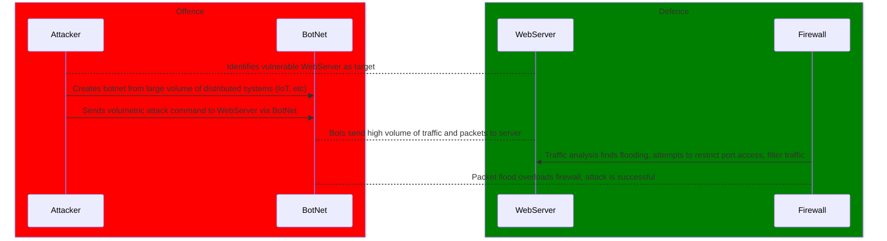

# Anatomy of a DDoS Attack

## Preliminary
* Attacker finds and chooses a WebServer to attack
* Attacker then creates/finds a useable BotNet to perform the attack
 * BotNet is a huge network of decentralized computer machines or VM sessions
* Attacker possibly obfuscates their traffic using a VPN or other service to make detection of the main machine more difficult

## Game Day
* Attacker sends command to the botnet to perform the DDoS attack on the WebServer
 * Attacker chooses between various methods for attack, including _Volumetric_, _Protocol_, or _Application Layer_
  * During a Volumetric Attack, the attacker will favor a flood of files or packets to overload the WebServer's bandwidth (ICMP Flood, UDP Flood, packet spoofs)
   * Attacker's BotNet sends requests to the WebServer, which responds with larger files
   * The sheer volume clogs bandwidth and prevents the WebServer from reacting
  * Protocol attacks target the server's own infrastructure and exploits it to interrupt the server
   * Can be done by _Ping of Death_, _IP Fragmentation_, _SYN-ACK flood_, among others
    * These take advantage of packet file sizes, SYN requests, and other infrastructure vulnerabilities to interrupt the server on the network layer
  * Application Layer attacks target servers that run web-based applications using requests that mirror the appearance of authentic access
    * These methods focus moreso on physical hardware, attempting to overload the processing power of the WebServer
	
## Postgame
* Firewall detects an attack and attempts to limit the scope of the DDoS attack or stop it altogether
 * Depending on the scale of the attack, may be sufficient, but can become overwhelmed
 * Filters out malicious traffic and requests
 * Sequesters access to sensitive files and machinery
 * Not as effective against volumetric attacks
* As failed connections mount or the Attacker has finished, the BotNet will be deactivated, and our intrepid thief will disappear into the night, corporate secrets tucked safely away